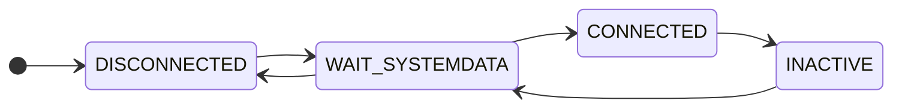

# AA Tablet API implemented in Python

This repository contains a python implementation of a subset of the AA Tablet API.

## Instructions for use

### Setting up python environment

```sh
python3 -m venv .venv
source .venv/bin/activate
python3 -m pip install -r requirements.txt
```

### Database file (`aircons.db.json`)

This software maintains a local "database" in the form of a `aircons.db.json` file that contains details about the air-con system, zones, parameters etc.  This file is updated as things change with the state of the a/c unit.

This file is a mirror of the file returned by the `/getSystemData` API call from the tablet.

The easiest way to get started is to make a backup of this "database" from your existing system, by issuing a `getSystemData` request to the web API.

```sh
curl http://<tablet-ip-address>:2025/getSystemData > ./db/aircons.db.json
```

If this is not possible (eg. your existing tablet is dead, ...), then some more work is required. You'll need to find your control-box unit ID, and the ID's of any attached sensors and/or other equipment, and build a file from scratch.

(!) *Possible future enhancement idea*: It should be possible to interrogate the control-box and infer at least of the relevant parameters to build a config file from scratch (eg. control box ID, sensor ID's etc). If anyone wants to help with that, patches would be gladly accepted.

### Running the process

```sh
python3 aa_api.py --log=DEBUG
```

## Theory of operation

The process maintains a `Store` object that contains the data from the aircons.db.json file.

This store is updated by API calls, and/or updates from the control box (eg. as sensed zone temperatures change).

The process uses Python's Flask library to expose an API on port 2025.  Flask is started in a separate thread.  Because of this, there's some locking around the `Store` methods to ensure that it's always kept in a consistent state despite being accessed/updated from both the API and the Control Box.

In terms of the API endpoints, the `/getSystemData` endpoint simply returns a copy of the DB dict.

When the `setAircon` API is called to update the data structure, the update is scanned to figure out what CB registers have changed need to be marked as dirty / flushed back to the CB.  The CAN processing logic then ensures that dirty registers are automatically flushed back to the CB, a maximum of 5 registers at a time.

The CAN protocol handler takes a state machine approach to managing communications with the server.



| State | Description |
| ----- | ----------- |
| DISCONNECTED | Initial state, system is disconnected, no CB has been detected.  System sends a `<U>getSystemData</U=15>` message to CB. |
| WAIT_SYSTEMDATA | In this state we are waiting for the CB to respond with a "CAN2 in use" message (to which we reply with a request to flush all registers, and transition to the connected state). |
| CONNECTED | Connection to CB has been established, messages can be sent. |
| INACTIVE  | Connection to CB has timed out.  When we receive another Ping message, we re-initiate comms. |

# Disclaimer

This has been hastily pieced together from various scraps of past work. It may or may not be fit for purpose. Use at your own risk.
